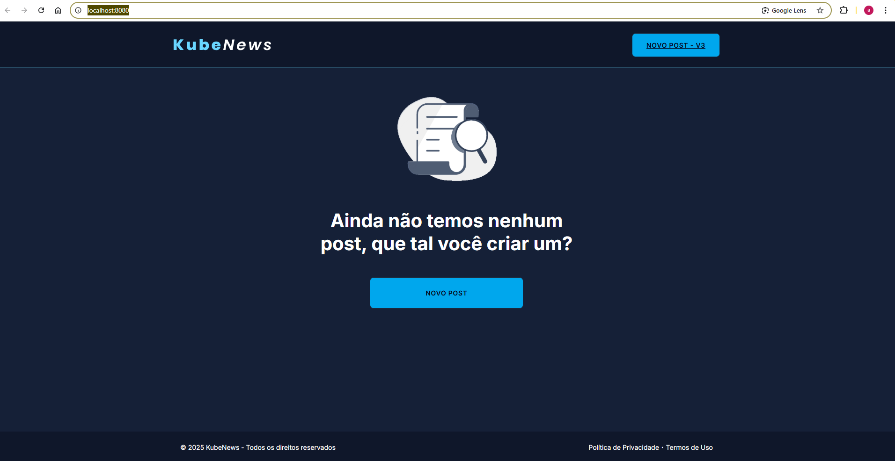
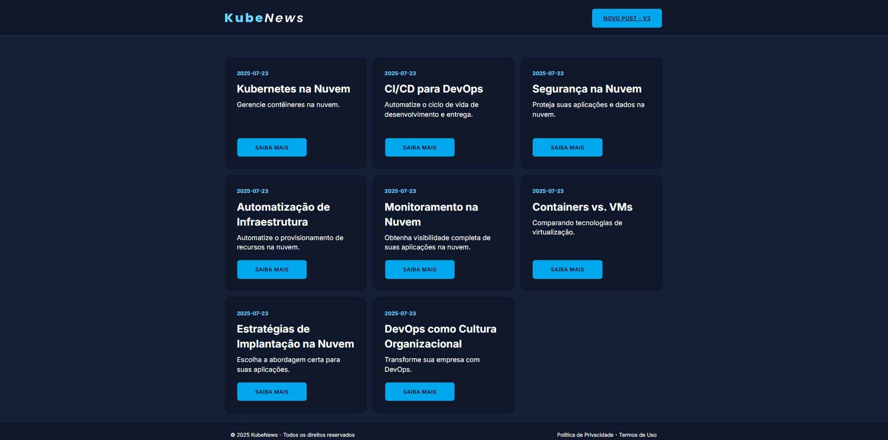

# 🐳 DevOps - KubeNews (Maratona DevOps com Fabricio Venorez)

Projeto desenvolvido como parte da **Maratona DevOps** com [Fabricio Venorez](https://www.linkedin.com/in/fabricioveronez/), onde trabalhamos com a aplicação **KubeNews**, uma aplicação simples para publicação de notícias com foco em práticas modernas de DevOps, Containers e uso de Inteligência Artificial no desenvolvimento.

---

## 📚 O que foi abordado

- Criação da imagem Docker da aplicação com base no `Dockerfile`;
- Construção e execução do container localmente;
- Publicação da imagem no Docker Hub;
- Uso da extensão **Docker AI** para suporte durante o desenvolvimento;
- Utilização do editor **Cursor** como ferramenta de apoio;
- Organização da estrutura do projeto com diretórios `src/` e `docs/`;

---

## ⚙️ Tecnologias utilizadas
- Node.js + Express

- SQLite (banco em memória)

- Docker

- Docker AI (docker ai)

- Cursor IDE (Editor com suporte à IA)

- REST Client (Extensão para VS Code)

---

## 💡 Principais diferenciais da aplicação
- Sem necessidade de banco de dados externo: a aplicação usa SQLite em memória, ideal para testes e protótipos rápidos;

- 100% conteinerizada: a execução da aplicação ocorre de forma isolada, via Docker;

- Otimizada com IA: utilizamos a Docker AI para revisar e melhorar a imagem da aplicação;

- Facilidade para popular dados: com um simples script REST, é possível adicionar posts de teste automaticamente.

---

## 📁 Estrutura do Projeto

```bash
📦 devops-kubenews-devops
├── 📁 docs                   # Documentação e relatórios
├── 📁 src                    # Código-fonte da aplicação Node.js
├── 🐳 Dockerfile             # Instruções para construção da imagem
├── 📄 popula-dados.http      # Requisições HTTP para popular o app
└── 📄 README.md              # Este documento
```
---

## 🚀 Como executar localmente

1. **Clone o repositório:**

```bash
git clone https://github.com/seu-usuario/devops-kubenews-docker.git
cd devops-kubenews-docker
```

2. **Build da imagem Docker:**

```bash
docker build -t ronayrton/kubenews:latest .
```

3. **Execute o container:**

```bash
docker run -d -p 3000:3000 ronayrton/kubenews:latest
```

4. **Popule dados (opcional):**

Abra o arquivo popula-dados.http em um editor como VS Code com a extensão REST Client ou ferramentas como Postman. Envie as requisições POST para o endpoint /api/post.

---

## 📤 Enviando a imagem para o Docker Hub

1. **Autentique-se no Docker Hub (caso ainda não tenha feito):**

```bash
docker login
Será solicitado seu nome de usuário e senha do Docker Hub.
```

2. **Tagueie a imagem com seu repositório do Docker Hub:**

```bash
docker tag kubenews ronayrton/kubenews:v1
Substitua ronayrton pelo seu nome de usuário no Docker Hub, se for diferente.
```

3. **Envie a imagem para o Docker Hub:**

```bash
docker push ronayrton/kubenews:v1
```

4. **(Opcional) Use a tag latest também:**

```bash
docker tag kubenews ronayrton/kubenews:latest
docker push ronayrton/kubenews:latest
```
---

## 📦 Docker Hub
A imagem foi publicada no Docker Hub e pode ser acessada em:

👉 https://hub.docker.com/r/seu-usuario/kubenews 

---

## Como a aplicação funciona sem banco de dados externo
A configuração do Sequelize no arquivo src/models/post.js utiliza:

```js
sqlite::memory:
```

- Isso significa que o banco de dados é criado em memória a cada execução da aplicação;

- Ideal para ambientes de laboratório e testes rápidos;

- Para produção, é possível trocar facilmente para um banco real (PostgreSQL, MySQL etc) via variáveis de ambiente.

---

## 🧠 Como ativar a Docker AI
1. No Docker Desktop, vá em Settings > Beta features;

2. Ative a opção Enable Docker AI;

3. Após ativar, você verá o assistente Ask Gordon;

4. Com o projeto aberto, execute:

```bash
docker ai
```

5. Você poderá solicitar sugestões e melhorias no Dockerfile, por exemplo:

```css
Analise o Dockerfile no diretório ./src e sugira melhorias. Responda em português Brasil.
```

---

## 📸 Prints da aplicação

### Tela inicial sem posts:


### Tela após popular com posts:



---

## 📌 Próximos passos
- Criar workflow de CI/CD com GitHub Actions.

- Orquestrar a aplicação com Kubernetes.

- Automatizar deploy com infraestrutura como código (IaC).

## 💼 Autor
Ronayrton Rocha
[LinkedIn](https://www.linkedin.com/in/ronayrton-rocha-13a872a8/)

